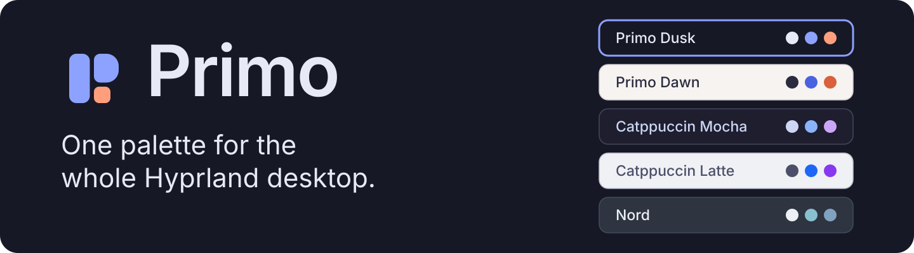
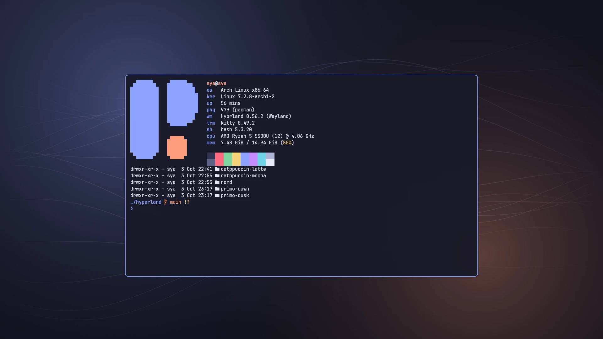
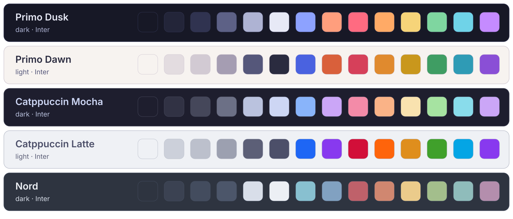
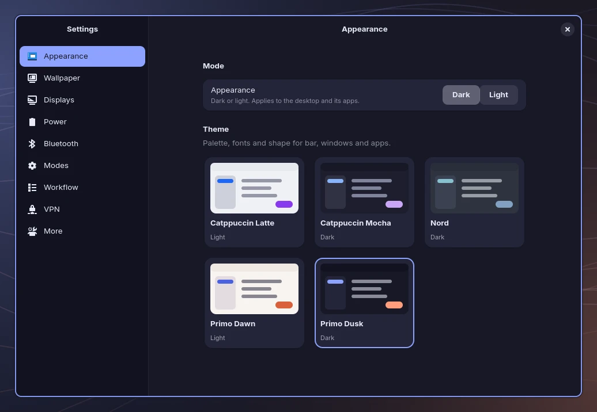
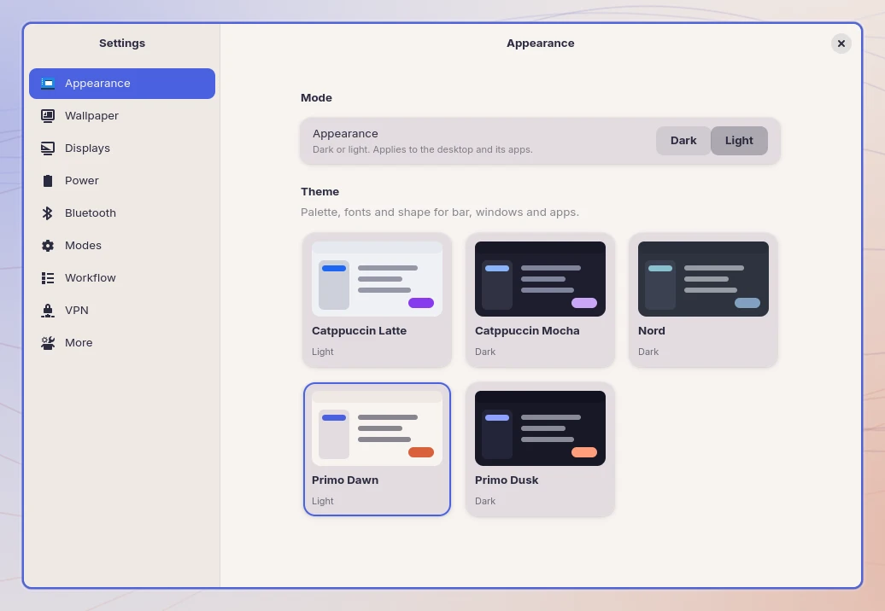
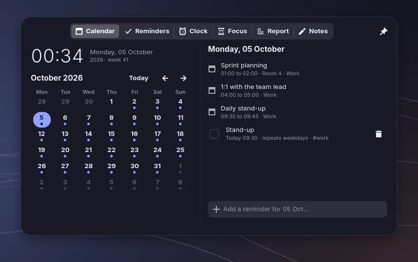

<h1 align="center">
  <picture>
    <source media="(prefers-color-scheme: dark)" srcset="docs/assets/banner-dark.png">
    <source media="(prefers-color-scheme: light)" srcset="docs/assets/banner-light.png">
    
  </picture>
</h1>

<p align="center">
  <b>A calm, themeable Hyprland desktop for Arch Linux.</b><br>
  One theme file colours the bar, launcher, terminal, lock screen, login screen, GTK and Qt apps, Firefox and VS Code,<br>
  and switches all of them at once, dark or light.
</p>

<p align="center">
  <a href="#install">Install</a> ·
  <a href="#one-palette-five-themes">Themes</a> ·
  <a href="#what-comes-with-it">What is in it</a> ·
  <a href="docs/KEYBINDINGS.md">Keybindings</a> ·
  <a href="docs/TOOLS.md">Tools</a> ·
  <a href="docs/THEMING.md">Make a theme</a>
</p>

Primo started as one person's Hyprland setup on one laptop, so it is small and opinionated: compact and crisp, a little macOS in spirit,
with a periwinkle accent and a coral spark. It comes with its own Settings, launcher, time hub and activity monitor, written for it.
Take all of it, or take a theme, a script or an idea.

<p align="center">
  <picture>
    <source media="(prefers-color-scheme: light)" srcset="docs/screenshots/dawn-desktop.webp">
    
  </picture>
</p>

## One palette, five themes

<picture>
  
</picture>

```bash
hypr-theme dawn          # every app switches at once
hypr-theme toggle        # dark or light (SUPER+SHIFT+T)
```

<table>
  <tr>
    <td width="50%"></td>
    <td width="50%"></td>
  </tr>
</table>

The same Settings window in Primo Dusk and Primo Dawn. Switching changes the bar, windows, terminal, lock screen and the apps around them together.

**Primo Dusk** (dark) and **Primo Dawn** (light) are the signature pair. Catppuccin Mocha, Catppuccin Latte and Nord come with it. A theme
is one short file with colours, fonts and shape (corner radius, gaps, a pill-shaped bar if you like); [make your own](docs/THEMING.md).
Wallpapers are drawn from each palette, so they always match.

## What comes with it

**Time hub.** Click the clock in the bar and a panel drops down: a calendar with your meetings, reminders you type in plain words
(`call the bank tomorrow 14:00 #work`), alarms and timers, a focus session that counts where your hours go, and notes. It floats over your
windows instead of pushing them, and its timers keep running when it is closed.

<p align="center">
  <picture>
    <source media="(prefers-color-scheme: light)" srcset="docs/screenshots/dawn-hub-calendar.webp">
    
  </picture>
</p>

**Activity.** `SUPER+SHIFT+Esc` shows what runs in the background and what it costs: CPU, memory, GPU, open connections, and who is holding
port 8080. Quit, force quit or freeze something with a click and a confirmation. The session itself is protected.

**Modes.** One action sets the machine up for what you are about to do (apps on their workspaces, a VPN, a power mode, do-not-disturb, a
focus session) and puts it back when you end it. Work, Research, Writing and Relax are there to start from; make your own.

Also in the box:

- **Settings** with appearance, wallpaper (slideshow, GIF, video), displays with a safe 10-second revert, power, Bluetooth and VPN.
- **Launcher** for apps, a calculator, your snippets, files and the web, plus a window switcher and a workspace overview.
- **Clipboard history**, screenshots with annotation, and screen recording with a timer in the bar.
- **Lock screen, login screen** and an optional **boot splash**, all drawn from the same palette.
- **Nautilus** as a floating Finder-style window with Quick Look, a notification centre, night light and battery warnings.

Everything is described in [docs/TOOLS.md](docs/TOOLS.md), and every key in [docs/KEYBINDINGS.md](docs/KEYBINDINGS.md).

## Install

Primo needs **Arch Linux** and **Hyprland 0.55 or newer** (the Lua configuration). Install the packages first; the list is in
[docs/INSTALL.md](docs/INSTALL.md). Then:

```bash
git clone https://github.com/sya17/primo.git && cd primo
./scripts/install.sh --dry-run --theme primo-dusk     # prints what it would do, changes nothing
./scripts/install.sh --theme primo-dusk
```

The installer links the configs into `~/.config` and moves a folder that is already there to `<app>.bak-<timestamp>`. Nothing is deleted.
To go back, remove the links and move the backups back. Log out and in once after the first install.

## What is tested

Primo is developed and tested on one machine: Arch Linux, Hyprland 0.56, an HP laptop with AMD graphics and a single 1920×1080 screen.

| | |
| --- | --- |
| Checked on every push | Shell syntax and ShellCheck, Python and Lua syntax, all five themes render with no placeholder left, generated TOML, JSON and SVG are valid, and the logic of the hub, modes, calendar feeds and activity monitor has tests. [](https://github.com/sya17/primo/actions/workflows/ci.yml) |
| Checked by hand on that machine | The bar, launcher, Settings, time hub, activity monitor, theme switching, and the Firefox and VS Code themes. |
| Not tested | NVIDIA graphics, several monitors, a display scale above 1, other distributions, and the boot splash on a real boot. Video wallpapers need `mpvpaper`, and the Docker view needs your user in the `docker` group. |

CI cannot start a Hyprland session (it only tries `Hyprland --verify-config`, best effort), so the compositor config is mostly checked by hand. If something breaks on your machine, an
[issue](https://github.com/sya17/primo/issues/new/choose) with the output of `hyprctl version` helps a lot.

## Keep reading

- [Install in detail](docs/INSTALL.md): packages, what the installer touches, optional extras and how to undo each one.
- [Keybindings](docs/KEYBINDINGS.md) and [the tools that come with Primo](docs/TOOLS.md).
- [Theming](docs/THEMING.md): make a theme, how GTK, Qt, Firefox and VS Code follow it.
- [How it fits together](docs/ARCHITECTURE.md), the [changelog](CHANGELOG.md) and [contributing](CONTRIBUTING.md).

## License

MIT, see [LICENSE](LICENSE). The Catppuccin and Nord palettes belong to their authors; fonts, icons and the apps Primo themes belong to theirs.
